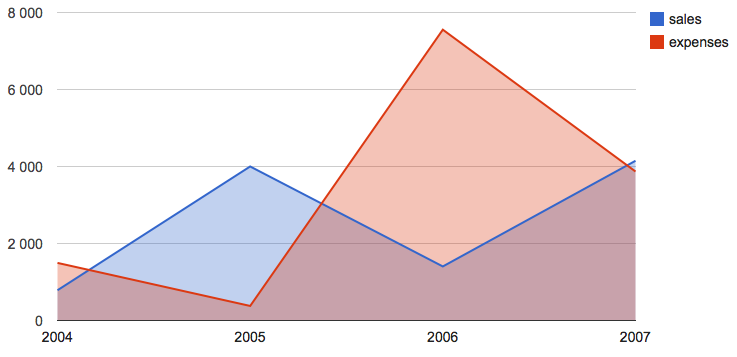
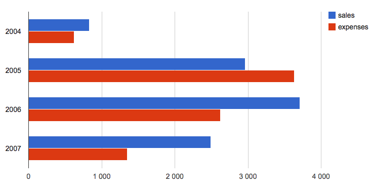
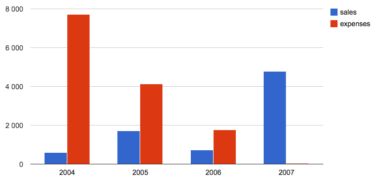
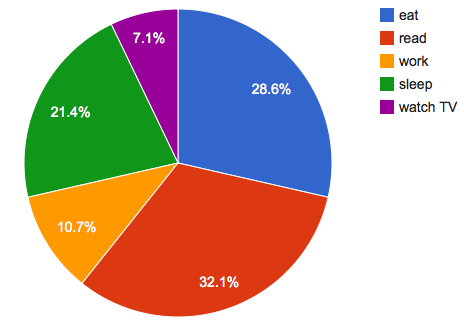
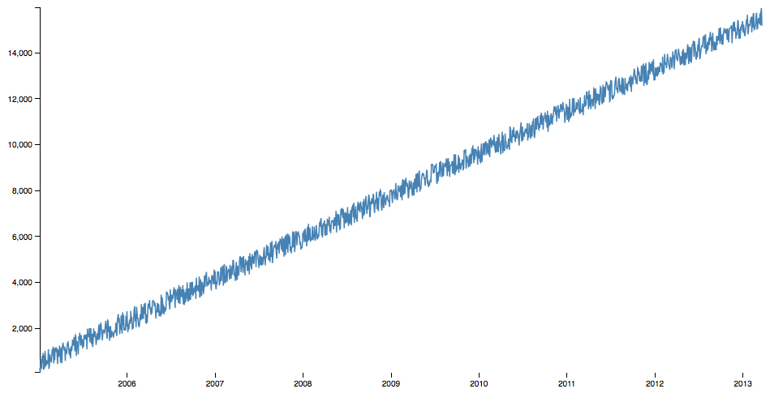

Graphs API
==========

The graphics you can use with mustachebox are designed to be easy to
use and easy to customize.

When you create your backend, you can reuse the javascripts files
mustachebox provides.

Each javascript files take a particular format of data to render your
graph.

Google Chart
------------

Those graph uses the google chart tools.

https://developers.google.com/chart/

Time series charts
__________________

Area, BarChart and ColumnChart all use the same format of data.

Data formating
~~~~~~~~~~~~~~

The time series chart take a list of integer for each series::

    [23, 45, 56, 67, 78]

you must also provide a list of label ::

    ['sales', 'expenses', 'counts', 'words counts', 'total']

Finaly, you must encapsulate your data in a dictionnary ::

    {
     2004: ['2004', 7160, 546],
     2005: ['2005', 5654, 5435],
     2006: ['2006', 7656, 6545],
     2007: ['2007', 5435, 6545],
     'label': ['year', 'sales', 'expenses']
    }

You can use a time_serie function to parse your data and use this
function in your method. For exemple ::

    def time_serie(**kwargs):
        """
        Render a time serie
        """
        resp = {2004: ['2004'],
                2005: ['2005'],
                2006: ['2006'],
                2007: ['2007']}

        for i in range(2):
            for k, v in resp.iteritems():
                v.append(int((random.random() * random.random()) * 10000))
            resp['label'] = ['year', 'sales', 'expenses']
        return resp

Area
____

Data formating
~~~~~~~~~~~~~~

See `Time series charts`_

Rendering
~~~~~~~~~

To render your chart you have to call the 'area' template ::

    self.template = "area"

Complete Example
~~~~~~~~~~~~~~~~
::

    def render_area(self, **kwargs):
        self.template = 'area'
        return time_serie(**kwargs)

Bar Chart
_________

Data formating
~~~~~~~~~~~~~~

See `Time series charts`_

Rendering
~~~~~~~~~

To render your chart you have to call the 'barchart' template ::

    self.template = "barchart"

Complete Example
~~~~~~~~~~~~~~~~
::

    def render_barchart(self, **kwargs):
        self.template = 'barchart'
        return time_serie(**kwargs)

Column Chart
____________

Data formating
~~~~~~~~~~~~~~

See `Time series charts`_

Rendering
~~~~~~~~~

To render your chart you have to call the 'columnchart' template ::

    self.template = "columnchart"

Complete Example
~~~~~~~~~~~~~~~~
::

    def render_columnchart(self, **kwargs):
        self.template = 'columnchart'
        return time_serie(**kwargs)

Pie Chart
_________

Data formating
~~~~~~~~~~~~~~

The data formating is a dictionnary containing :

* a list of label
* a list of dataset containing a string and an integer

The resulting dictionnary must look like this ::

    {'label': ['name', 'count'],
     'records': [
                    ['a name', 10],
                    ...
                ]
    }

The keys 'label' and 'records' are **mandatory**

Rendering
~~~~~~~~~

To render your chart you have to call the 'pie_chart' template ::

    self.template = "pie_chart"

Complete Example
~~~~~~~~~~~~~~~~
::

    def pie_chart(self):
        self.template = "pie_chart"

        label = ['name', 'count']
        activities = []
        words = ['eat', 'read', 'work', 'sleep', 'watch TV']
        for elem in words:
            activities.append([elem, int(random.random() * 10)])

        return {'label': label, 'records': activities}

D3.js
-----

Those graph uses the D3 js Toolkit.

http://d3js.org/

Line Chart
__________

Data formating
~~~~~~~~~~~~~~

The data must be a list of dict.

Each dict constain 2 keys :

* date : a timestamp multiplied by 1000 (python timestamps are in
  seconds and javascript timestamps are in milliseconds)

* value : an integer or a float

Rendering
~~~~~~~~~

To render your chart you have to call the 'line_chart' template ::

    self.template = "line_chart"

Complete Example
~~~~~~~~~~~~~~~~
::

    def line_chart(self):

        response = []
        self.template = "line_chart"
        date = datetime.datetime(2005, 1, 1, 0, 0, 0)
        for i in range(1500):
            date += datetime.timedelta(days=2)
            response.append({
                'date': time.mktime(date.timetuple()) * 1000,
                'value': (i * 10) + int(random.random() * 1000)})
        return response
